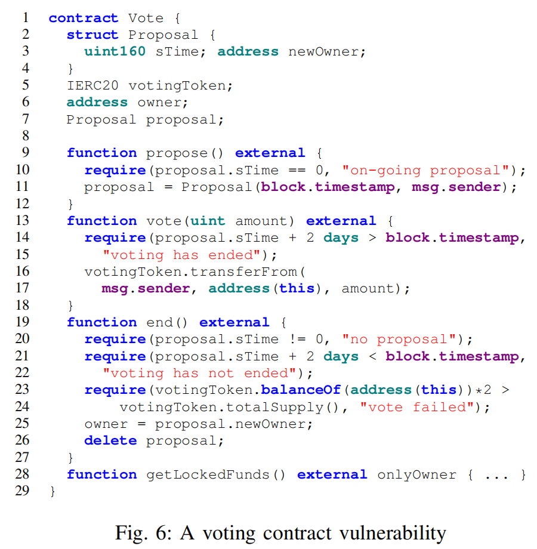

# Privilege Escalation

These bugs arise when an (unexpected) sequence of functions can be invoked to bypass access control.

Example. Figure 6 presents a real-world case from an
anonymized contract (upon developers’ request). The code is
completely rewritten to ensure anonymity while its essence is
retained. This is a voting contract where users can elect a new
contract owner by voting. In lines 2-4, the contract defines a
data structure Proposal to describe a proposal with sTime
denoting the start time of voting and newOwner the proposed
new owner. There are three state variables votingToken,
owner, and proposal denoting the token used for voting
(line 5), the current contract owner (line 6), and an on-going
proposal (line 7), respectively. Function propose (line 9)
allows a user to propose himself as the new owner, which
creates a new proposal (at line 11) and sets the current block
time as the start time and msg.sender the proposed owner.
Observe that there can only be one on-going proposal (line 10).
Users vote by function vote, in which they send their voting
tokens to the contract (lines 16-17) to support a proposal.
Note that users can only vote in the first two days after
the voting starts, guarded by the require in lines 14-15.
The voting ends two days later, and the decision is made by
function end. Function end first checks whether there is an
on-going proposal (line 20) and whether the voting has lasted
for at least 2 days (lines 21-22). In lines 23-24, the function
then checks whether over 50% votingToken holders have
voted for the proposal. If so, a critical operation of setting
a new contract owner is performed (line 25). At line 28, a
privileged function getLockedFunds allows the owner to
get all the locked funds. Note that both functions vote and
end strictly constrain the invocation time, which constitutes
an access control preventing the two functions from being
invoked in a single transaction. Otherwise, an adversary could
invoke function vote with a tremendous amount of flashloaned votingToken and force a malicious proposal to go
through (similar to the exploit in §VII-A). 

However, an unexpected call sequence can evade the access control. Specifically,
consider an adversary Alice proposes herself as the owner.
When the time is approaching the deadline proposal.sTime
+ 2 days, she launches an attack wrapping the following
actions into a single transaction, including 1) flash-loaning
a large amount of votingToken from its AMM contract,
2) invoking votingToken.transferFrom, a fund transfer
function provided by all ERC20 tokens to directly transfer the
loaned amount to the contract without any access control, 3)
invoking end to become the owner, 4) getting locked funds
by function getLockedFunds, and 5) paying off the flashloan debt. Intuitively, Alice “votes” without calling the vote
function. The developers did not anticipate such a business
flow and hence did not guard properly.

*Remix illustration below* *
